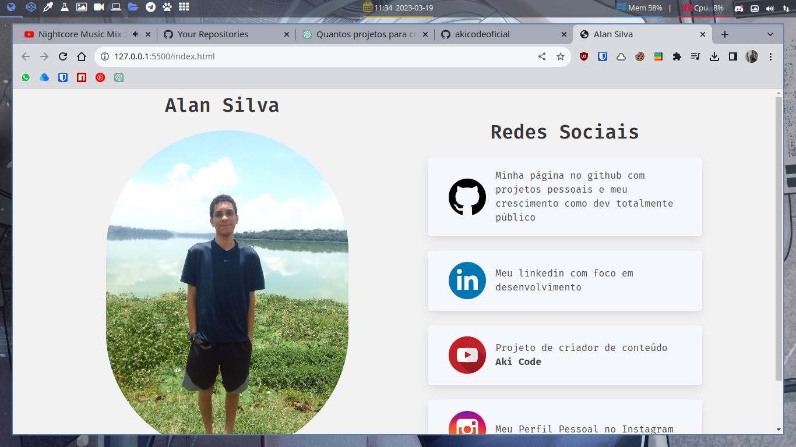

# Meus Links Pessoais

Esse repositório é um portfolio pessoal que contém a foto de perfil do Github e os meios de comunicação do autor. O objetivo do projeto é fornecer uma maneira fácil para os visitantes do perfil conhecerem o autor e entrar em contato com ele através das suas redes sociais.

O projeto é uma página estática criada usando HTML, CSS e JavaScript, e pode ser facilmente personalizada para refletir a personalidade e habilidades do autor. Os visitantes podem clicar nos links para acessar as redes sociais do autor, como LinkedIn, Twitter, Facebook, e outras plataformas de comunicação.

O repositório pode ser baixado e modificado para atender às necessidades individuais do usuário, e é uma ótima maneira de criar um portfolio pessoal simples e elegante que apresenta suas habilidades de desenvolvimento web e suas informações de contato.

